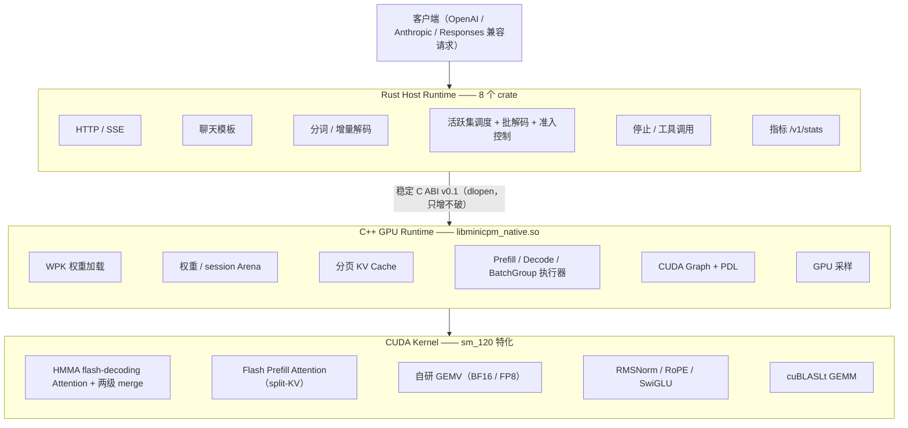

# MiniCPM5-5080Fast

[中文](README.md) | [English](README_EN.md)

MiniCPM5-2B 在 NVIDIA GeForce RTX 5080（Blackwell，SM120）上的高性能本地推理服务。

**Rust Host Runtime + C ABI + C++/CUDA 单卡特化 GPU Runtime**——生产进程零 Python 依赖。同机、同精度（BF16 vs BF16）公平对照下，**batch-1 解码在 16 ~ 128K 全部七个上下文长度上领先 vLLM 5.7% ~ 17.9%**；flash prefill 使 TTFT 在各上下文长度上与 vLLM 持平；多请求并发由调度器自动进行批解码（batched decode），稳态聚合吞吐 ~988 tok/s（8 并发 greedy）。

| 指标（batch-1 greedy，空闲 GPU，多轮均值） | BF16 | FP8 |
|---|---|---|
| decode t/s @ 短上下文 | **179**（vLLM 154 → **快 16%**） | 327（较自身 BF16 +84%） |
| decode t/s @ 2K 上下文 | **179**（vLLM 152 → **快 18%**） | 312（+75%） |
| decode t/s @ 8K 上下文 | **164**（vLLM 145 → **快 13%**） | 282（+72%） |
| decode t/s @ 128K 上下文 | **81**（vLLM 77 → **快 6%**） | 100（+24%） |
| prefill tok/s @ 2K / 128K | 19.0k / 3.7k（vLLM 20.6k / 3.65k，持平） | — |
| 并发聚合（8×2K，greedy） | 稳态 **~988 tok/s**（vLLM 稳态 ~790） | — |

完整优化轨迹、精度报告与各项结论见 [`docs/EXPERIMENT_LOG.md`](docs/EXPERIMENT_LOG.md)。

## 特性

- **多协议 API**：`POST /v1/chat/completions`（OpenAI 兼容：SSE 流式 / 非流式、`tools`、`stop`、`enable_thinking`、`max_tokens`、采样参数）、`POST /v1/messages`（Anthropic Messages 兼容：`system`、`tool_use`/`tool_result`、SSE 事件流）、`POST /v1/responses`（OpenAI Responses 兼容），另含 `/v1/models`、`/health`、`/v1/stats`
- **0 ~ 128K 全范围上下文**：分块 prefill（8448/块）+ 激活 scratch 缩减，单 session 最大 131072 token（`max_position_embeddings` 原生上限）
- **HMMA flash-decoding decode attention**（生产默认）：tensor core（mma.m16n8k16 bf16）执行 QK/PV、C→A fragment 寄存器直通、两级并行 merge、CHUNK 按会话长度分级（64/128/256）；`MC_ATTN_HMMA_OFF=1` 回退 SIMT 路径
- **Flash prefill attention**（生产默认）：16-token q-tile × HMMA、小 T split-KV、cp.async 双缓冲流水；较旧 O(T²) kernel 提升 2.7×~17×；`MC_PREFILL_FLASH_OFF=1` 回退
- **并发推理**：活跃集调度 + 时间片（quantum）交错（无队头阻塞、慢消费者隔离）；**greedy 流自动并入批解码**（`mc_batch_group_*` ABI，eager 精确 n 步，`MC_BATCH_OFF=1` 回退为时间片轮转并发）；准入控制（队列上限 + HTTP 429 + 排队超时）；`/v1/stats` 含 `scheduler`/`recent_requests`/batch 指标；进程退出时有序关停
- **无 Python 生产进程**：Rust 负责 HTTP/模板/分词/调度/流式；C++/CUDA 负责权重、KV Cache、矩阵计算、采样
- **SM120 特化 GPU runtime**：CUDA Graph（PDL 边手工修补）、kv-major GQA attention、rope 吸收进 attention phase0、自研 bf16/fp8 GEMV（81-95% 峰值带宽）、cuBLASLt prefill/批 GEMM
- **FP8 权重包**（E4M3 逐行 scale，weight-only，decode 较 BF16 +24%~84%）；单请求 FP8 TPOT 3.21ms vs vLLM FP8 4.71ms（**+32%**，公平同精度对照）
- **分层验证体系**：单算子测试（含 fragment 级逐位基准）→ CPU 双实现交叉验证 → golden 逐层对齐 → 端到端逐 token 对齐 → soak/双线程并发/OOM 压测（native ctest 14 项 + Rust 155+ 项全绿）

## 架构



架构决策的来龙去脉与完整优化轨迹见 [实验记录](docs/EXPERIMENT_LOG.md)。

## 仓库结构

```text
rust/        Rust Host：server / tokenizer / template / generation /
             scheduler（活跃集+批解码）/ runtime / runtime-sys / metrics
native/      C++/CUDA：include(ABI) / runtime（含 batch_group）/ kernels/sm120
tools/       离线工具：权重打包 / FP8 量化 / numpy 参考前向 / 比对
models/      模型包：model.wpk(BF16) / model_fp8.wpk(FP8) / manifest
tests/       golden 数据（tokenizer/template/runtime）
benchmark/   scripts（perf sweep / vllm 对照 / 并发基准）/ results（JSON 产物）
docs/        实验记录（含各专项结论与决策记录）
```

## 环境要求

- NVIDIA GeForce RTX 5080（Compute Capability 12.0 / sm_120），驱动 ≥ 570
- CUDA Toolkit ≥ 12.8（含 nvcc）
- Rust stable ≥ 1.85、CMake ≥ 3.28、Ninja
- Python 3.10+（仅离线工具与 golden 生成需要，生产不依赖）
- 显存：BF16 权重 ~4.8GB；FP8 双拷贝 ~7.0GB；每并发 session 另需 arena（见 [显存规划](#显存规划)）

## 快速开始

### 1. 构建与测试

```bash
# Native（先构建 GPU runtime）
cmake -S native -B build/native -G Ninja -DCMAKE_BUILD_TYPE=Release -DCMAKE_CUDA_ARCHITECTURES=120
cmake --build build/native -j
ctest --test-dir build/native --output-on-failure        # 14 项全绿

# Rust Host
cargo build --workspace --release
cargo test --workspace                                   # 155+ 项全绿
```

### 2. 模型准备（首次）

```bash
# 从 HuggingFace 下载官方文件（revision 3497c460，见 models/minicpm5-2b/reference_manifest.json）
#（tokenizer.json 等模型大文件不入 git 库，必须下载后放入 models/minicpm5-2b/）
python -m venv .venv && .venv/bin/pip install numpy tokenizers

# 打包 BF16 权重包（safetensors -> model.wpk，含 qkv/gate_up 融合布局）
.venv/bin/python tools/pack_weights.py --model-dir models/minicpm5-2b

# （可选）生成 FP8 权重包
.venv/bin/python tools/quantize.py --model-dir models/minicpm5-2b
```

### 3. 启动服务

```bash
target/release/minicpm-server \
  --native-lib build/native/libminicpm_native.so \
  --model-dir models/minicpm5-2b \
  --precision bf16 \        # 或 fp8
  --host 0.0.0.0 --port 8931 \
  --max-sessions 8 \        # 真并发上限（活跃 session 数）
  --queue-limit 32 \        # 等待队列上限（满载返回 429 + Retry-After）
  --queue-timeout-s 120     # 排队超时（秒）
```

省略 `--native-lib` 时以 MockEngine 运行（供无 GPU 环境冒烟测试与前端联调）。

### 4. 调用

```bash
# 非流式
curl -s localhost:8931/v1/chat/completions -H 'Content-Type: application/json' -d '{
  "model": "minicpm5-2b",
  "messages": [{"role": "user", "content": "写一个Python快速排序并解释。"}],
  "max_tokens": 128
}'

# 流式（SSE）
curl -N localhost:8931/v1/chat/completions -H 'Content-Type: application/json' -d '{
  "model": "minicpm5-2b",
  "messages": [{"role": "user", "content": "你好"}],
  "stream": true, "max_tokens": 64
}'

# 并发可观测
curl -s localhost:8931/v1/stats   # scheduler{queue_depth,active_sessions,batch} + recent_requests
```

采样遵循 OpenAI 语义：`temperature > 0` 即采样；`temperature = 0` 贪心（greedy 流可被调度器自动并入批解码）。

## 性能

同机对照（RTX 5080 16GB，batch-1 greedy，要求 GPU 空闲，多轮取均值；vLLM 0.29.0 / torch 2.13.0+cu130；**公平对比：BF16 vs BF16**，FP8 仅用于展示自身量化收益，FP8 数据另与 vLLM FP8 单独对照）。

### Decode TPOT（7 个上下文长度，`benchmark/results/perf_sweep.json` / `vllm_sweep.json`）

| 上下文 | 本项目 BF16 | 本项目 FP8 | vLLM BF16 | BF16 领先 |
|---|---|---|---|---|
| 16 tok | **5.60 ms**（179 t/s） | 3.06 ms（327 t/s） | 6.52 ms（154 t/s） | **+16.4%** |
| 512 tok | **5.65 ms**（177 t/s） | 3.16 ms（316 t/s） | 6.54 ms（153 t/s） | **+15.9%** |
| 2048 tok | **5.59 ms**（179 t/s） | 3.21 ms（312 t/s） | 6.59 ms（152 t/s） | **+17.9%** |
| 8192 tok | **6.11 ms**（164 t/s） | 3.54 ms（282 t/s） | 6.90 ms（145 t/s） | **+13.1%** |
| 32768 tok | **7.37 ms**（136 t/s） | 4.91 ms（204 t/s） | 8.08 ms（124 t/s） | **+9.7%** |
| 65536 tok | **9.10 ms**（110 t/s） | 6.65 ms（150 t/s） | 9.74 ms（103 t/s） | **+7.0%** |
| 130816 tok | **12.36 ms**（81 t/s） | 9.98 ms（100 t/s） | 13.06 ms（77 t/s） | **+5.7%** |

- 单请求 FP8 公平对照（vs vLLM FP8 dynamic）：TPOT **3.21 vs 4.71 ms（+32%）**（`vllm_fp8.json`）
- 历次优化累计：128K BF16 20.22 → 12.36 ms（−39%）；prefill 340 → 3,678 tok/s（10.8×）

### Prefill / TTFT（flash prefill，生产默认）

| prompt | 本项目 | vLLM | 比值 |
|---|---|---|---|
| 2048 | 19.0k tok/s / 108ms | 20.6k / 99.5ms | 92% |
| 8192 | 18.0k / 456ms | 18k / 457ms | ~100% |
| 32768 | 10.1k / 3.24s | 10.2k / 3.19s | 99% |
| 65536 | 6.4k / 10.2s | 6.4k / 10.2s | ~100% |
| 130816 | 3.68k / 35.6s | 3.65k / 35.8s | 100.8% |

### 并发（8×2048 prompt / 64 tok / greedy，`concurrency_path_b.json`）

| K | 批解码聚合 | 时间片轮转（不批解码） | 稳态批步长 |
|---|---|---|---|
| 1 | 137 tok/s | 137 tok/s | 5.6 ms（solo 路由，零回归） |
| 4 | 279 tok/s | 138 tok/s | 7.5 ms |
| 8 | **371 tok/s**（稳态 ≈ **988**） | 139 tok/s | 8.1 ms |

如实说明的局限（结论记录于 `EXPERIMENT_LOG` §8.6/§9）：大量新请求集中准入的 ramp 重载场景下，BF16 聚合吞吐受 tensor core 计算争用限制，上限 ≈432 tok/s（vLLM 同样受限）；FP8 并发批解码路径两次中止（CUDA-core 指令瓶颈 / cublasLt 缺少相应 scale 模式），实现代码已保留，待库升级后重启。

### 复现

```bash
# native 七档上下文扫描（按上下文长度建 session）
MC_PERF_CTXS=16,512,2048,8192,32768,65536,130816 \
MC_PERF_OUT=benchmark/results/perf_sweep.json build/native/perf_v2
.venv-vllm/bin/python benchmark/scripts/vllm_bench_sweep.py       # vLLM 对照
.venv-vllm/bin/python benchmark/scripts/vllm_bench_concurrent.py  # vLLM 并发基线
.venv-vllm/bin/python benchmark/scripts/vllm_bench_fp8.py         # vLLM FP8 基线
cargo run -p minicpm-scheduler --release --example concurrency_bench  # 我方并发基准
MC_BATCH_CORUN_PROBE=1 build/native/batch_test                    # 并行同跑探针
```

## 精度与验证

- **Tokenizer/Template**：与官方 Transformers 语义逐 token 一致（golden 快照锁定）
- **BF16 forward**：42 层逐张量与 numpy 参考对齐（cos ≥ 0.9995）；greedy 输出逐 token 一致
- **HMMA attention / flash prefill**：fragment 级逐位基准比对（与 SIMT 参考逐位一致）、CPU bf16-P 证明 ≤2.5e-7 锁定布线正确性、输出 ulp 直方图（median=0）；eager vs CUDA Graph 逐 token 一致
- **批解码**：批 vs solo 前缀一致率 100%（640 token 零翻转）；受控实验证明批解码本身引入的误差为零；跨 batch 组合时近并列位置可能翻转（与 vLLM 同性质，已在契约中说明）
- **FP8**：logits cos avg 0.9986，token 分歧仅出现在近并列位置（`fp8_accuracy.json`）
- **稳健性**：soak 零泄漏、双线程真并发回归测试（T2b）、OOM 干净失败、200 次 reset 结果确定可复现、退出有序关停（10/10 干净退出）
- 各项优化的验证与结论详见 [实验记录](docs/EXPERIMENT_LOG.md) §8-§11

## 显存规划

16GB 卡可用显存 ≈ 14.9GB（基础数据实测于 `vram_budget.json`，另含本轮新增项）：

| 模式 | 权重 | 每 session arena @2048 ctx | @8448 ctx | 备注 |
|---|---|---|---|---|
| BF16 | 4.82 GB | ~303 MB | ~908 MB | 含 gemm_ws 16MB + prefill partials 40MB |
| FP8（双拷贝） | 6.97 GB | ~303 MB | ~908 MB | 同上；**ctx8448×8 并发不可用**（~14.1GB 超限） |

- 批组（批解码）额外 ~26-40MB（组激活 + partials，容量 8 槽）
- 128K 单 session：arena ≈ 6.2GB（KV 5.64GB + scratch 0.53GB）；BF16 可行（~11GB），FP8 双拷贝紧张（~13.2GB）

## 文档

- [English README](README_EN.md)
- [实验记录](docs/EXPERIMENT_LOG.md)——P0→P7 时间线 + 各性能专项（decode HMMA / prefill flash / 并发路径 A/B / FP8）的完整结论与决策记录
- `benchmark/results/*.json`——性能数据产物（**本地生成、不入 git 库**，可用上文「复现」一节的命令重新生成）

## 开发环境（本仓库容器）

基于 `nvidia/cuda:12.8.1-cudnn-devel-ubuntu24.04`，GPU 直通 + host 网络：

```bash
docker compose up -d --build          # 构建并常驻
ssh -p 2301 dev@<host>                # 或 docker compose exec -u dev dev bash
```

要点：项目挂载于 `/workspace`；Rust 工具链在 `/opt/rustup`、`/opt/cargo`（named volume）；cargo 走 rsproxy 镜像；host 网络下 8080 常被占用，示例统一用 8931。

## License

Apache-2.0
