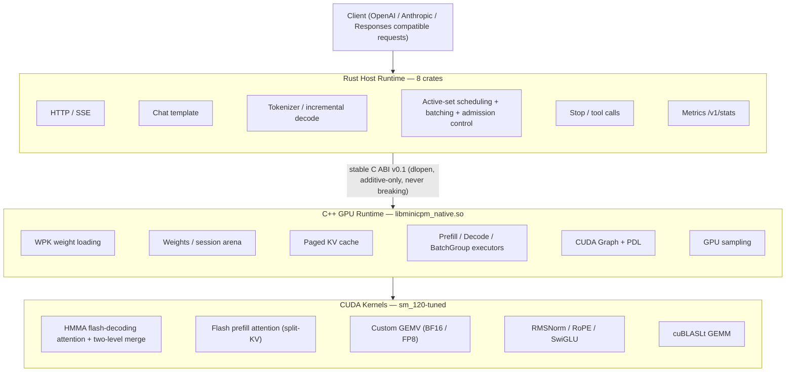

# MiniCPM5-5080Fast

[中文](README.md) | [English](README_EN.md)

A high-performance local inference server for MiniCPM5-2B on the NVIDIA GeForce RTX 5080 (Blackwell, SM120).

**Rust host runtime + C ABI + single-card-tuned C++/CUDA GPU runtime** — zero Python dependency in the production process. In a fair same-machine, same-precision (BF16 vs BF16) comparison, **batch-1 decode leads vLLM by 5.7% ~ 17.9% across all seven context tiers from 16 to 128K**; flash prefill brings TTFT to parity with vLLM at every tier; multi-request concurrency is automatically batched by the scheduler (batched decode), with a steady-state aggregate throughput of ~988 tok/s (8-way concurrent greedy).

| Metric (batch-1 greedy, idle GPU, multi-run average) | BF16 | FP8 |
|---|---|---|
| decode t/s @ short context | **179** (vLLM 154 → **16% faster**) | 327 (+84% over its own BF16) |
| decode t/s @ 2K context | **179** (vLLM 152 → **18% faster**) | 312 (+75%) |
| decode t/s @ 8K context | **164** (vLLM 145 → **13% faster**) | 282 (+72%) |
| decode t/s @ 128K context | **81** (vLLM 77 → **6% faster**) | 100 (+24%) |
| prefill tok/s @ 2K / 128K | 19.0k / 3.7k (vLLM 20.6k / 3.65k, on par) | — |
| Concurrent aggregate (8×2K, greedy) | steady-state **~988 tok/s** (vLLM steady-state ~790) | — |

For the full optimization trajectory, accuracy reports, and verdict records, see [`docs/EXPERIMENT_LOG.md`](docs/EXPERIMENT_LOG.md).

## Features

- **Multi-protocol API**: `POST /v1/chat/completions` (OpenAI-compatible: SSE streaming / non-streaming, `tools`, `stop`, `enable_thinking`, `max_tokens`, sampling parameters), `POST /v1/messages` (Anthropic Messages-compatible: `system`, `tool_use`/`tool_result`, SSE event streams), `POST /v1/responses` (OpenAI Responses-compatible), plus `/v1/models`, `/health`, `/v1/stats`
- **Full 0 ~ 128K context range**: chunked prefill (8448 per chunk) + activation scratch shrinking, single session up to 131072 tokens (the native `max_position_embeddings` cap)
- **HMMA flash-decoding decode attention** (production default): tensor cores (mma.m16n8k16 bf16) execute QK/PV, C→A fragment register pass-through, two-level parallel merge, CHUNK tiered per session (64/128/256); `MC_ATTN_HMMA_OFF=1` falls back to the SIMT path
- **Flash prefill attention** (production default): 16-token q-tiles × HMMA, small-T split-KV, cp.async double-buffered pipeline; 2.7×~17× over the old O(T²) kernel; `MC_PREFILL_FLASH_OFF=1` falls back
- **Concurrent inference**: active-set scheduling + quantum interleaving (no head-of-line blocking, slow consumers isolated); **greedy streams auto-batched** (`mc_batch_group_*` ABI, eager exact n-step, `MC_BATCH_OFF=1` falls back to time-sliced concurrency); admission control (queue cap + HTTP 429 + queue timeout); `/v1/stats` includes `scheduler`/`recent_requests`/batch metrics; orderly shutdown on process exit
- **No Python in the production process**: Rust handles HTTP/templates/tokenization/scheduling/streaming; C++/CUDA handles weights, the KV cache, matrix math, and sampling
- **SM120-specialized GPU runtime**: CUDA Graph (PDL edges hand-patched), kv-major GQA attention, RoPE absorbed into attention phase0, custom bf16/fp8 GEMV (81-95% of peak bandwidth), cuBLASLt prefill/batch GEMM
- **FP8 weight package** (E4M3 per-row scale, weight-only, decode +24%~84% over BF16); single-request FP8 TPOT 3.21 ms vs vLLM FP8 4.71 ms (**+32%**, fair same-precision comparison)
- **Verification pyramid**: per-kernel tests (including fragment-level bit anchors) → dual CPU implementation cross-validation → layer-by-layer golden alignment → end-to-end token-for-token alignment → soak/dual-thread concurrency/OOM stress tests (native ctest 14 items + Rust 155+ items, all green)

## Architecture



For the reasoning behind these architecture decisions and the full optimization trajectory, see the [Experiment Log](docs/EXPERIMENT_LOG.md).

## Repository Layout

```text
rust/        Rust Host：server / tokenizer / template / generation /
             scheduler（活跃集+合批）/ runtime / runtime-sys / metrics
native/      C++/CUDA：include(ABI) / runtime（含 batch_group）/ kernels/sm120
tools/       离线工具：权重打包 / FP8 量化 / numpy 参考前向 / 比对
models/      模型包：model.wpk(BF16) / model_fp8.wpk(FP8) / manifest
tests/       golden 数据（tokenizer/template/runtime）
benchmark/   scripts（perf sweep / vllm 对照 / 并发基准）/ results（JSON 产物）
docs/        实验记录（含各战役判决留档）
```

## Requirements

- NVIDIA GeForce RTX 5080 (Compute Capability 12.0 / sm_120), driver ≥ 570
- CUDA Toolkit ≥ 12.8 (including nvcc)
- Rust stable ≥ 1.85, CMake ≥ 3.28, Ninja
- Python 3.10+ (only needed for offline tooling and golden generation; not a production dependency)
- VRAM: BF16 weights ~4.8GB; FP8 dual-copy ~7.0GB; each concurrent session needs an extra arena (see [VRAM planning](#vram-planning))

## Quick Start

### 1. Build and Test

```bash
# Native（先构建 GPU runtime）
cmake -S native -B build/native -G Ninja -DCMAKE_BUILD_TYPE=Release -DCMAKE_CUDA_ARCHITECTURES=120
cmake --build build/native -j
ctest --test-dir build/native --output-on-failure        # 14 项全绿

# Rust Host
cargo build --workspace --release
cargo test --workspace                                   # 155+ 项全绿
```

### 2. Model Preparation (first run)

```bash
# 从 HuggingFace 下载官方文件（revision 3497c460，见 models/minicpm5-2b/reference_manifest.json）
#（tokenizer.json 等模型大文件不入 git 库，必须下载后放入 models/minicpm5-2b/）
python -m venv .venv && .venv/bin/pip install numpy tokenizers

# 打包 BF16 权重包（safetensors -> model.wpk，含 qkv/gate_up 融合布局）
.venv/bin/python tools/pack_weights.py --model-dir models/minicpm5-2b

# （可选）生成 FP8 权重包
.venv/bin/python tools/quantize.py --model-dir models/minicpm5-2b
```

### 3. Start the Server

```bash
target/release/minicpm-server \
  --native-lib build/native/libminicpm_native.so \
  --model-dir models/minicpm5-2b \
  --precision bf16 \        # 或 fp8
  --host 0.0.0.0 --port 8931 \
  --max-sessions 8 \        # 真并发上限（活跃 session 数）
  --queue-limit 32 \        # 等待队列上限（满载返回 429 + Retry-After）
  --queue-timeout-s 120     # 排队超时（秒）
```

Omit `--native-lib` to run with the MockEngine (for smoke tests and frontend integration on hosts without a GPU).

### 4. Call the API

```bash
# 非流式
curl -s localhost:8931/v1/chat/completions -H 'Content-Type: application/json' -d '{
  "model": "minicpm5-2b",
  "messages": [{"role": "user", "content": "写一个Python快速排序并解释。"}],
  "max_tokens": 128
}'

# 流式（SSE）
curl -N localhost:8931/v1/chat/completions -H 'Content-Type: application/json' -d '{
  "model": "minicpm5-2b",
  "messages": [{"role": "user", "content": "你好"}],
  "stream": true, "max_tokens": 64
}'

# 并发可观测
curl -s localhost:8931/v1/stats   # scheduler{queue_depth,active_sessions,batch} + recent_requests
```

Sampling follows OpenAI semantics: `temperature > 0` enables sampling; `temperature = 0` selects greedy (greedy streams can be auto-batched by the scheduler).

## Performance

Same-machine comparison (RTX 5080 16GB, batch-1 greedy, idle-GPU discipline, multi-run averages; vLLM 0.29.0 / torch 2.13.0+cu130; **fair basis: BF16 vs BF16**, with FP8 reported only as this project's own quantization gain and the FP8 axis compared separately against vLLM FP8).

### Decode TPOT (7 context tiers, `benchmark/results/perf_sweep.json` / `vllm_sweep.json`)

| Context | This project BF16 | This project FP8 | vLLM BF16 | BF16 lead |
|---|---|---|---|---|
| 16 tok | **5.60 ms** (179 t/s) | 3.06 ms (327 t/s) | 6.52 ms (154 t/s) | **+16.4%** |
| 512 tok | **5.65 ms** (177 t/s) | 3.16 ms (316 t/s) | 6.54 ms (153 t/s) | **+15.9%** |
| 2048 tok | **5.59 ms** (179 t/s) | 3.21 ms (312 t/s) | 6.59 ms (152 t/s) | **+17.9%** |
| 8192 tok | **6.11 ms** (164 t/s) | 3.54 ms (282 t/s) | 6.90 ms (145 t/s) | **+13.1%** |
| 32768 tok | **7.37 ms** (136 t/s) | 4.91 ms (204 t/s) | 8.08 ms (124 t/s) | **+9.7%** |
| 65536 tok | **9.10 ms** (110 t/s) | 6.65 ms (150 t/s) | 9.74 ms (103 t/s) | **+7.0%** |
| 130816 tok | **12.36 ms** (81 t/s) | 9.98 ms (100 t/s) | 13.06 ms (77 t/s) | **+5.7%** |

- Single-request FP8 fair comparison (vs vLLM FP8 dynamic): TPOT **3.21 vs 4.71 ms (+32%)** (`vllm_fp8.json`)
- Cumulative across optimization campaigns: 128K BF16 20.22 → 12.36 ms (−39%); prefill 340 → 3,678 tok/s (10.8×)

### Prefill / TTFT (flash prefill, production default)

| prompt | This project | vLLM | Ratio |
|---|---|---|---|
| 2048 | 19.0k tok/s / 108ms | 20.6k / 99.5ms | 92% |
| 8192 | 18.0k / 456ms | 18k / 457ms | ~100% |
| 32768 | 10.1k / 3.24s | 10.2k / 3.19s | 99% |
| 65536 | 6.4k / 10.2s | 6.4k / 10.2s | ~100% |
| 130816 | 3.68k / 35.6s | 3.65k / 35.8s | 100.8% |

### Concurrency (8×2048 prompt / 64 tok / greedy, `concurrency_path_b.json`)

| K | Batched aggregate | Time-sliced (no batching) | Steady-state batch step |
|---|---|---|---|
| 1 | 137 tok/s | 137 tok/s | 5.6 ms (solo routing, zero regression) |
| 4 | 279 tok/s | 138 tok/s | 7.5 ms |
| 8 | **371 tok/s** (steady-state ≈ **988**) | 139 tok/s | 8.1 ms |

Honest boundaries (verdict records in `EXPERIMENT_LOG` §8.6/§9): in ramp-heavy scenarios (large bursts of new requests admitted together), BF16 aggregate throughput is capped at ≈432 tok/s by tensor-core compute contention (vLLM hits the same ceiling); the FP8 concurrent batch path took two stop-losses (CUDA-core instruction wall / missing cublasLt scale mode), with the machinery preserved to restart once the library is upgraded.

### Reproducing

```bash
# native 7 档扫描（按档建 session）
MC_PERF_CTXS=16,512,2048,8192,32768,65536,130816 \
MC_PERF_OUT=benchmark/results/perf_sweep.json build/native/perf_v2
.venv-vllm/bin/python benchmark/scripts/vllm_bench_sweep.py       # vLLM 对照
.venv-vllm/bin/python benchmark/scripts/vllm_bench_concurrent.py  # vLLM 并发基线
.venv-vllm/bin/python benchmark/scripts/vllm_bench_fp8.py         # vLLM FP8 基线
cargo run -p minicpm-scheduler --release --example concurrency_bench  # 我方并发基准
MC_BATCH_CORUN_PROBE=1 build/native/batch_test                    # 共跑探针
```

## Accuracy & Verification

- **Tokenizer/Template**: token-for-token parity with official Transformers semantics (locked by golden snapshots)
- **BF16 forward**: all 42 layers aligned tensor-by-tensor against the numpy reference (cos ≥ 0.9995); greedy output matches token for token
- **HMMA attention / flash prefill**: fragment-level bit anchors (bit-exact against the SIMT reference), CPU bf16-P proof ≤2.5e-7 pinning down wiring correctness, output ULP histograms (median=0); eager vs CUDA Graph token-for-token identical
- **Batched decode**: batched vs solo prefix agreement rate 100% (zero flips over 640 tokens); controlled experiments prove batching itself introduces zero error; near-ties spanning batch composition can flip (same property as vLLM, documented in the contract)
- **FP8**: logits cos avg 0.9986, token divergence occurs only at near-tie positions (`fp8_accuracy.json`)
- **Robustness**: zero leaks under soak, dual-thread true-concurrency regression anchor (T2b), clean failure under OOM, deterministic across 200 resets, orderly shutdown on exit (10/10 clean exits)
- For per-campaign verification and verdict details, see the [Experiment Log](docs/EXPERIMENT_LOG.md) §8-§11

## VRAM Planning

A 16GB card has ≈ 14.9GB usable (base measured in `vram_budget.json` + new items added this round):

| Mode | Weights | Per-session arena @2048 ctx | @8448 ctx | Notes |
|---|---|---|---|---|
| BF16 | 4.82 GB | ~303 MB | ~908 MB | incl. gemm_ws 16MB + prefill partials 40MB |
| FP8 (dual-copy) | 6.97 GB | ~303 MB | ~908 MB | same as above; **ctx8448×8 concurrency is a forbidden configuration** (~14.1GB exceeds the limit) |

- Batch groups (batched decode) add ~26-40MB (group activations + partials, capacity 8 slots)
- 128K single session: arena ≈ 6.2GB (KV 5.64GB + scratch 0.53GB); BF16 feasible (~11GB), FP8 dual-copy tight (~13.2GB)

## Documentation

- [中文 README](README.md)
- [Experiment Log](docs/EXPERIMENT_LOG.md) — the full P0→P7 timeline + performance campaigns (decode HMMA / prefill flash / concurrency path A/B / FP8) with complete verdict records
- `benchmark/results/*.json` — performance artifacts (**generated locally, not tracked in git**; regenerate with the commands in the "Reproduction" section above)

## Development Environment (this repo's container)

Based on `nvidia/cuda:12.8.1-cudnn-devel-ubuntu24.04`, GPU passthrough + host networking:

```bash
docker compose up -d --build          # 构建并常驻
ssh -p 2301 dev@<host>                # 或 docker compose exec -u dev dev bash
```

Notes: the project is mounted at `/workspace`; the Rust toolchain lives under `/opt/rustup` and `/opt/cargo` (named volumes); cargo goes through the rsproxy mirror; port 8080 is often occupied under host networking, so the examples consistently use 8931.

## License

Apache-2.0
